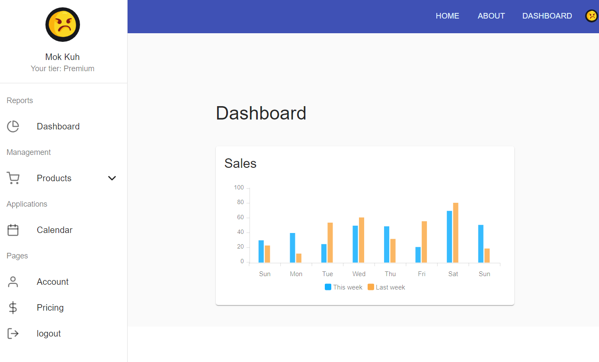
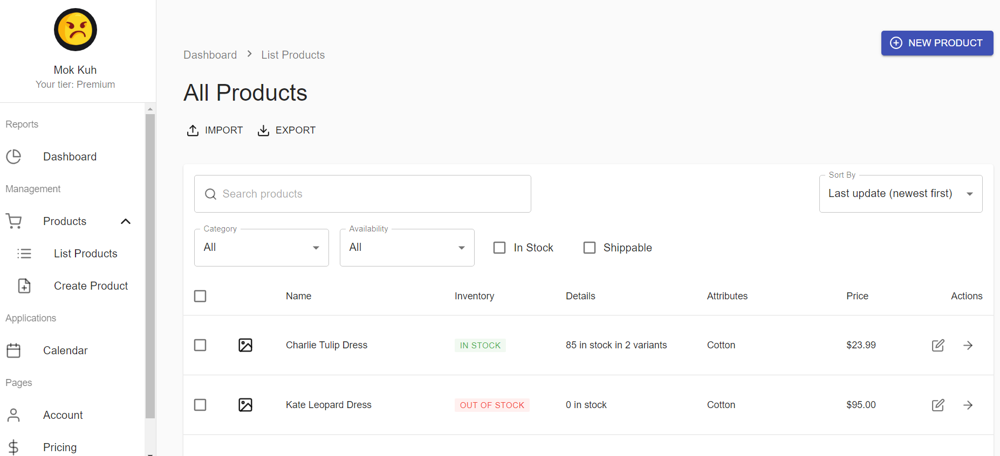
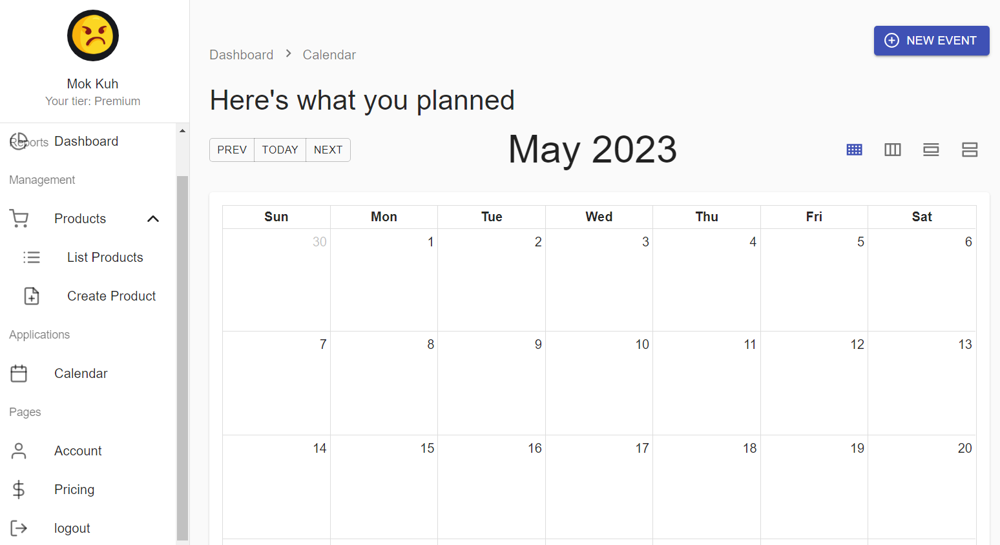
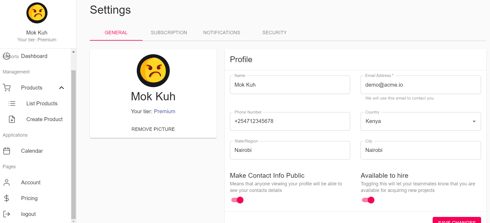

# Tikiti Enterprise App

The Tikiti Enterprise Dashboard is a robust web application built with TypeScript, React, Material-UI, Redux, Docker, and Nginx, aimed at efficiently managing profiles, products, events, and accounts.

Profiles: The app provides a user-friendly interface for creating and updating user profiles, allowing administrators to manage user information securely.

Products: With seamless integration of Redux, the app facilitates effortless management of products. Users can add, edit, and remove products, while real-time updates ensure accurate inventory tracking.

Events: The dashboard excels in event management. Admins can schedule and oversee various events, utilizing Material-UI's sleek components for an intuitive scheduling experience.

Accounts: Users can manage their accounts efficiently through the app. Redux ensures that account data remains consistent across different views, enhancing the user experience.

Docker & Nginx: The app is containerized using Docker, ensuring consistent deployment across environments. Nginx serves as a reverse proxy, enhancing performance and enabling secure communication.

JSON Server: To simulate a backend during development, JSON Server is integrated, allowing frontend developers to work seamlessly with a RESTful API and test various scenarios.

## Views

<p align="center">
  
</p>

<p align="center">
  
</p>

<p align="center">
  
</p>

<p align="center">
  
</p>

## Technologies Used

- TypeScript
- React
- Redux
- JSON-server
- Material UI
- Docker
- Nginx

## Getting Started

1. Clone the repository:
   ```
   git clone git@github.com:rOluochKe/tikiti.git
   cd tikiti
   ```
2. Install dependencies for the app:

   ```
   npm install

   Start Backend:
   npm run backend

   Start frontend:
   npm start

   View the app on your web browser on: http://localhost:3000/login
   ```

## Contribution

Feel free to contribute to this project by submitting issues, pull requests, or new features. Please follow the project's coding standards and guidelines.
